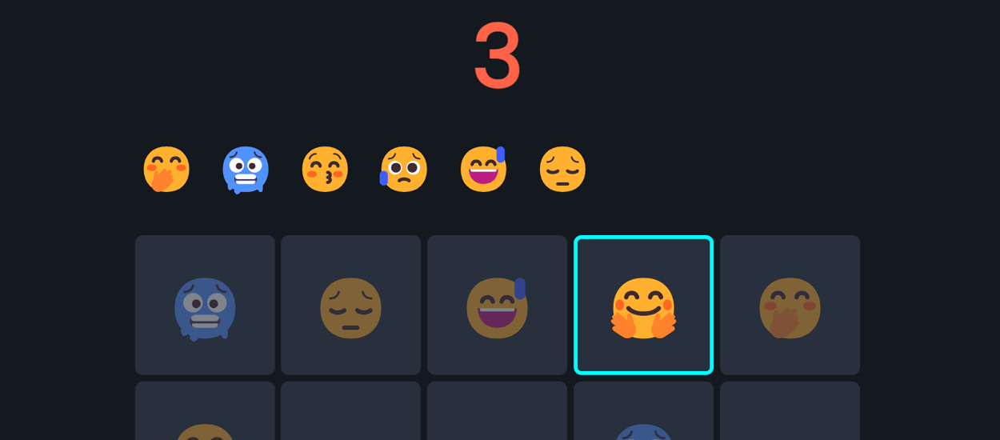

# Jogo da memória em Svelte 😃 == 😃

[![Button Icon]][Link] 

Jogo de memória simples para praticar um pouco de Svelte.

>⌨️ Se estiver usando teclado, <kbd>   ESC   </kbd> pausa o jogo

- State managment 
- Reactivity

[Button Icon]: https://img.shields.io/badge/ACESSAR-memory.gabes.dev-blue
[Link]: https://memory.gabes.dev/ 'Jogo da memória'
